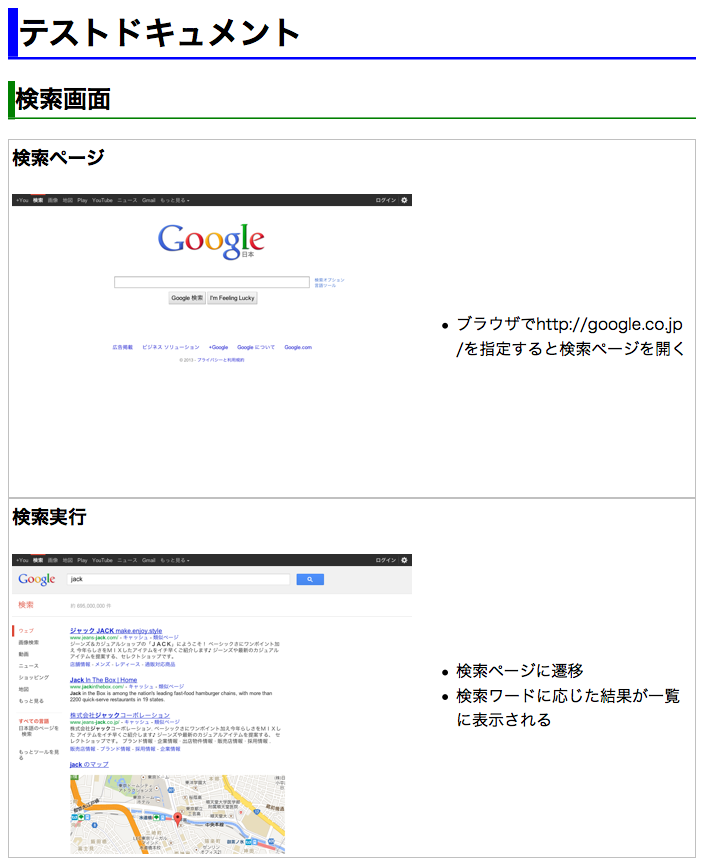
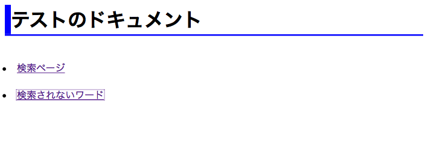
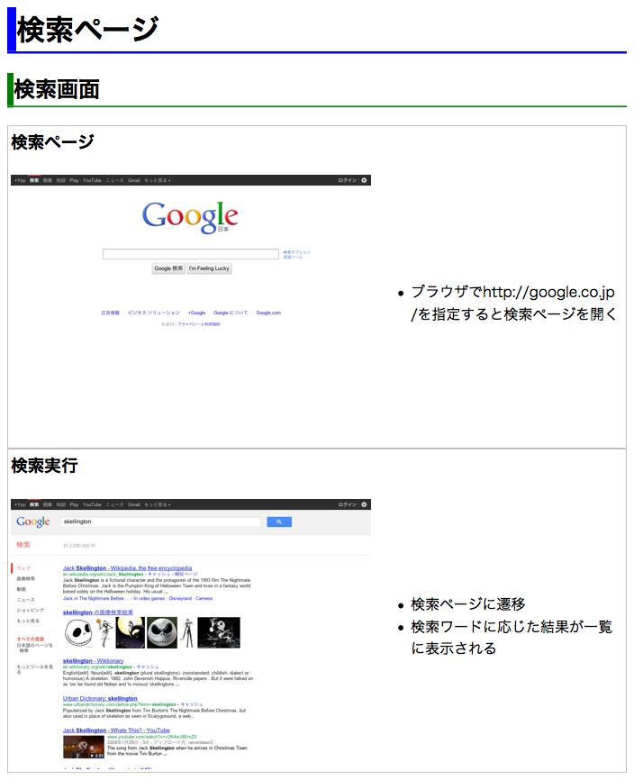
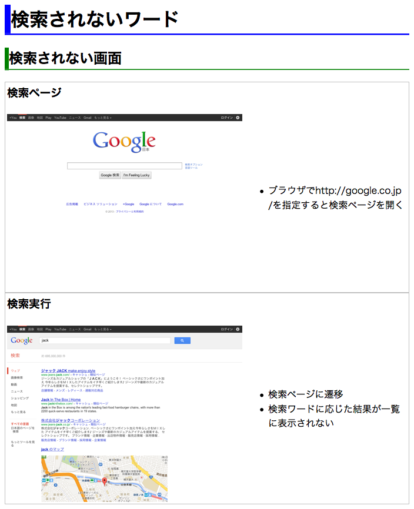

SkellingtonJs
=============

画面テストの定義から画面マニュアルを生成する的なテストフレームワーク

- - - 

利用準備
---------------------------------

### CasperJSのインストール

CasperJSが必須のため下記ページより事前に設定

* <http://casperjs.org/>
* CasperJSは1.1-beta1をインストールする

### SkellingtonJsの設置

* リソースの配置
`$ git clone https://github.com/plasticscafe/SkellingtonJs.git `

* パスの設定
`$ export PATH=$PATH:{インストールしたディレクトリ}/SkellingtonJs `

* コマンドの実行
`$ skellington テストファイル.coffee `

- - - 

基本的なドキュメントの作成
---------------------------------

以下のサンプルはCoffeeScriptで記載するが、JavaScriptでも実行可能

    # Basic Setting
    option = 
      base : 
        url : 'http://www.google.co.jp/'
    # Module Require
    path = require('system').args[5].replace('--path=','')
    jack = require(path + '/jack.js')(require, path, option)
    # Test Define 
    jack.capter '検索画面', -> #　*** Capter Define ***
      jack.start '/', -> 
        jack.section '検索ページ'  # *** Section Define ***
        jack.isUrlMatch('/', 'ブラウザでhttp://google.co.jp/を指定すると検索ページを開く')
      jack.then -> jack.form("[action='/search']", {q: "skellington"})
      jack.then -> 
        jack.section title:'検索実行'   # *** Section Define ***
        jack.isUrlMatch('search', '検索ページに遷移')
        jack.assertTextExists('Jack Skellington', '検索ワードに応じた結果が一覧に表示される')
    # Test Execute 
    jack.run ->
      jack.createHtml()

sample.coffeeとして上記を作成

### テストの実行
	$ skellington sample.coffee
	# ***** 検索画面
	PASS ブラウザでhttp://google.co.jp/を指定すると検索ページを開く
	PASS 検索ページに遷移
	PASS 検索ワードに応じた結果が一覧に表示される

### マニュアルの確認

index.htmlが生成されます
- - -

- - - 
## ドキュメントの定義
### 章(Capter)
* 機能単位等の区分け。
` jack.capter [章情報], 「コールバック] `で定義
* 章情報は章タイトルのみの場合は文字列で記述
* タイトル以外を記述する場合は以下のハッシュを記述（省略可）
	* title: [章タイトル]
    * description: [章説明]
    * prefix: [画像識別用のprefix] # 複数ページ作成時(後述)に使用
* コールバックには節、テスト定義、キャプチャ宣言等を記述

### 節(Section)
* 画面単位等の区分け。
` jack.section [節情報] `で定義
* 節情報は節タイトルのみの場合は文字列で記述
* タイトル以外を記述する場合は以下のハッシュを記述（省略可）
	* title: [節タイトル]
    * description: [節説明]
    * hidden: [boolean: ドキュメントに記載するか否か] # 該当節でテスト実施のみの場合はtrue     (Default: false)
    * capture: [boolean: 画面キャプチャを修得するか否か] # 節宣言時の画面キャプチャを取得(Default: true)
* 節宣言以降のテスト定義・キャプチャ宣言はこの節内に含まれる
	* 新しい節宣言がされた場合、それ以降は次の節内のものとなる

### テストの定義（ドキュメント上のラベル）

* [テストメッセージ]はマニュアルに項目として羅列される（節でhiddenオプションを付けた場合は出力されない）
* 失敗したテストはマニュアル上で[Fail]表示される
* 同一節内で複数宣言可

#### 基本的なテスト

* `jack.isUrlMatch [url], [テストメッセージ]`
	* 現在滞在中のページURLが指定のものとマッチするかどうか

#### CasperJSのテストも使用可能

* CasperJsのtesterに準ずる
	* <http://docs.casperjs.org/en/latest/modules/tester.html>
* casper.testと同様に`jack.assert<テスト名> [arg1], [arg2] … , [テストメッセージ]`の形式で記術

### キャプチャ宣言
* テスト中の特定状態の画面キャプチャを取得する
	* `jack.capture [ファイル名] `で宣言
	* ファイル名は省略可、その場合はデフォルトのファイル名が付与される
	* 同一節内で複数宣言可

- - - 

基本設定
---------------------------------
ファイル冒頭でoption(ハッシュ)として宣言
    
    option = 
      viewportSize: # キャプチャのサイズ
        width: 1024
        height: 768
      verbose: true # ログ出力をするか
      logLevel: "debug" # ログ出力のレベル (CasperJSに準ずる)
    base : # 基本設定
      url : 'http://www.google.co.jp/' # 対象アプリケーションのベースURL
    output:
      dir : './output' # 生成するマニュアルの出力先

      
- - - 

複数ページのドキュメントの作成
---------------------------------

複数ページにわたるドキュメントを生成する場合は、各ページ用のテストファイルとは別に一覧定義ファイルを作成します。

    # Basic Setting
    option = 
      base : 
        url : 'http://www.google.co.jp/'
    # Module Require
    path = require('system').args[5].replace('--path=','')
    zero = require(path + '/zero.js')(require, path, option)
    # Page Define 
    zero.addPage 'sample001.coffee'
    zero.addPage 'sample002.coffee'
    # Test Execute
    zero.run 'テストのドキュメント'
    
docs.coffeeとして上記を作成し、また各ページ用テストファイルとしてsample001.coffee,  sample002.coffeeを作成します

#### sample001.coffee

    module.exports = (require, option, next) -> 
      # Module Require
      path = require('system').args[5].replace('--path=','')
      jack = require(path + '/jack.js')(require, path, option)
      # Test Define 
      jack.capter {title:'検索画面', prefix:'001search'}, ->
        jack.start '/', -> 
          jack.section '検索ページ'
          jack.isUrlMatch('/', 'ブラウザでhttp://google.co.jp/を指定すると検索ページを開く')
        jack.then -> jack.form("[action='/search']", {q: "skellington"})
        jack.then -> 
          jack.section title:'検索実行'
          jack.isUrlMatch('search', '検索ページに遷移')
          jack.assertTextExists('Jack Skellington', '検索ワードに応じた結果が一覧に表示される')
      # Test Execute 
      jack.run ->
        next jack, '検索ページ', 'search' # ページタイトル、ページファイルを定義

#### sample002.coffee

    module.exports = (require, option, next) -> 
      # Module Require
      path = require('system').args[5].replace('--path=','')
      jack = require(path + '/jack.js')(require, path, option)
      # Test Define 
      jack.capter {title:'検索されない画面', prefix:'002search'}, ->
        jack.start '/', -> 
          jack.section '検索ページ'
          jack.isUrlMatch('/', 'ブラウザでhttp://google.co.jp/を指定すると検索ページを開く')
        jack.then -> jack.form("[action='/search']", {q: "jack"})
        jack.then -> 
          jack.section title:'検索実行'
          jack.isUrlMatch('search', '検索ページに遷移')
          jack.assertTextDoesntExist('Jack Skellington', '検索ワードに応じた結果が一覧に表示されない')
      # Test Execute 
      jack.run ->
        next jack, '検索されないワード', 'no_search'

- - - 
### テストの実行
	$ skellington docs.coffee
	# ***** 検索画面
	PASS ブラウザでhttp://google.co.jp/を指定すると検索ページを開く
	PASS 検索ページに遷移
	PASS 検索ワードに応じた結果が一覧に表示される
	# ***** 検索されない画面
	PASS ブラウザでhttp://google.co.jp/を指定すると検索ページを開く
	PASS 検索ページに遷移
	PASS 検索ワードに応じた結果が一覧に表示されない

- - -
### マニュアルの確認

各テストページsearch.htmlとno_search.html、その一覧をまとめたindex.htmlが生成
- - -
#### 一覧ページ: index.html
- - -

#### テストページ1: search.html
- - -

#### テストページ2: no_search.html
- - -

- - - 

ドキュメントテンプレートのカスタマイズ
---------------------------------
* テストファイルと同階層にtemplateディレクトリを作成
* SkellingtonJsフォルダ内のtemplateをコピーしてカスタマイズしたファイルを作成
#### doc.html
画面マニュアル用テンプレート 
#### index.html
一覧ページ用テンプレート
	
カスタムテンプレートが存在しない場合は上記のデフォルトテンプレートを使用
